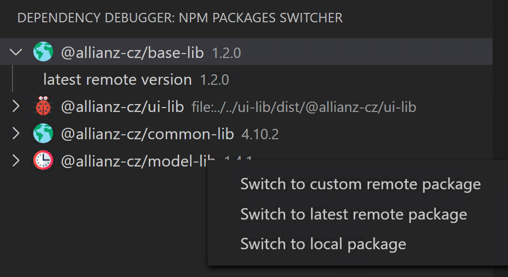

##VSC plugin to switch NPM references between remote and local packages
Your comments are welcomed at the project root page [https://mikeska.tech/posts/vsc-plugin-switch-local-remote-packages-npm
](https://mikeska.tech/posts/vsc-plugin-switch-local-remote-packages-npm)

### Switch now references between remote and local packages with one-click ease
When developing and debugging NPM packages, switching between local and remote reference has always been a big overhead. 
Now is all that possible with the one-click approach.

This extension appears in the Activity bar of the Visual Studio Code. Just only thing you have to configure is the list of package names and its local path representation.



### The picture says it all

Here is displayed the entire stack of the functionality

- The Earth icon indicates that you are currently referencing the remote package.
- The ladybug icon indicates the local reference.
- The clock icon is indicating that your switch action is currently being processed.
- In the item detail is currently available one info item, the latest version of the remote package
- The list of actions in the right-click context menu.

### The configuration

Before the first use, you have to configure the actual libraries, which you want to get displayed.
- name - the package name
- path - the path to the local npm package

> dependencyDebugger.libraries
```
[
    {
        "name": "@angular/common",
        "path": "../test-lib/@angular/common"
    }
]
```

### Ready to hear about possible improvements
It's just been released, so gonna still a bit work on the design, but I am ready to hear some tips on how to improve and be glad for every bug reported.
Currently occasionally crashing when switching (like 1 out of 10), this is caused by console command executed, NPM INSTALL, most possibly because some file lock still hanging on the file. Sometimes by network error when downloading.

May the plugin be with you!
